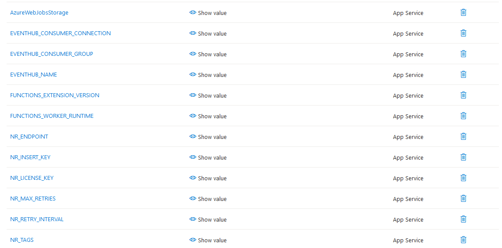
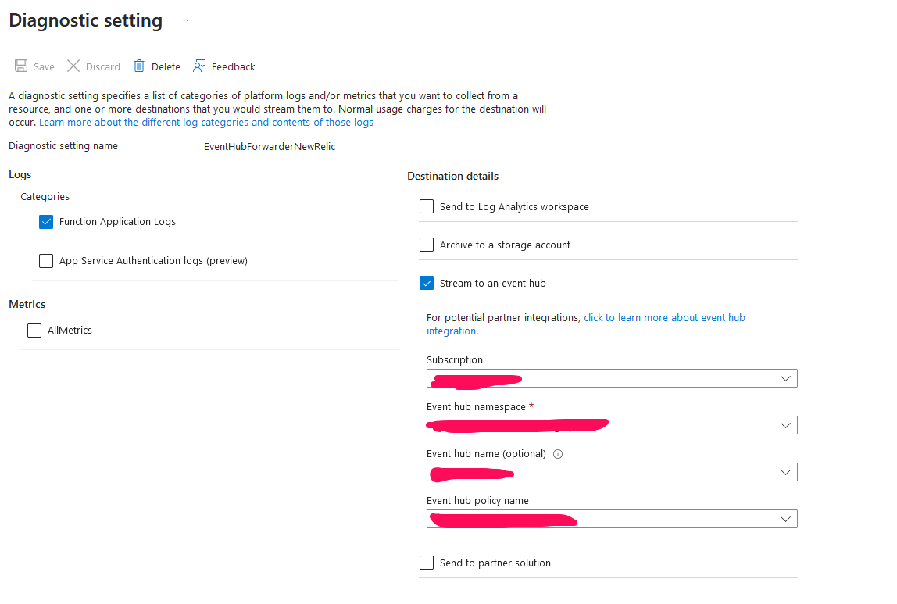

# EventHubForward-NewRelic
    - Example: the azure function receives message from EventHub and then send messages to New Relic.

### Steps
+ Zip the javascript function
    ```
    powershell Compress-Archive ./EventHubForwarder/* EventHubForward.zip
    ```

+ Create an Event Hub
    + 1.1 Settings > Networking > Select All networks in Public Access tab
    + 1.2 OR Select Selected networks and add range IPs

+ Create an Azure Function
    + FUNCTIONS_WORKER_RUNTIME = Node
    + Add values into Settings > Environment Variables
    + Add NewRelic Variables
    

    + Add Event Logs of the Azure Function to Event Hub
        + Go to Monitoring > Diagnostics settings
        + Add Event Hub Setting in the Azure Function
        

+ Upload the EventHubForward.zip file to the storage account container.
    + Create Generate SAS (expired time to access the zip file)
    + Copy the URL and paste into Environment Variables with the WEBSITE_RUN_FROM_PACKAGE variable
